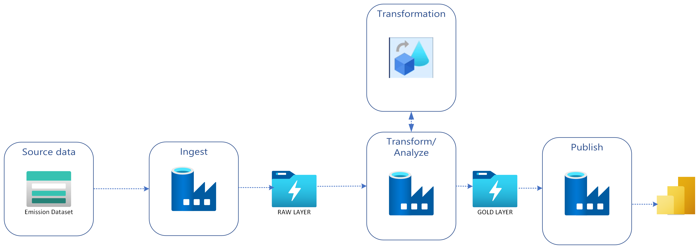

# CarbonInsight

An Emissions Analytics Repository

## Introduction
The agricultural sector contributes to almost 62% of the total global Co2 emissions, making a significant contributor to climate change. The aim of this project is to create a dashboard to visualize and monitor the impact of agricultural activities on Co2 emissions. In order to create the Power BI dashboard, we will be employing several data engineering tools and principles along the way.

## Proposed Architecture
The source data will reside in the Azure blob storage where every time a new source file is added, the Azure Data Factory pipeline will ingest into our raw container which is Azure Data Lake Storage Gen 2 (there would be an event trigger set on the pipeline). After the data is present in the raw container, we would be using Data Flows to make basic transformations as the data source does not require a lot of complex transformations and proceed to store it in our gold layer which is also a ADLS Gen 2, after which we will make the cleaned data available for visualization at Power BI. Below is the architecture diagram of the proposed solution!

## Appendix

Data used in this project has been obtained from [Kaggle](https://www.kaggle.com/datasets/alessandrolobello/agri-food-co2-emission-dataset-forecasting-ml)

